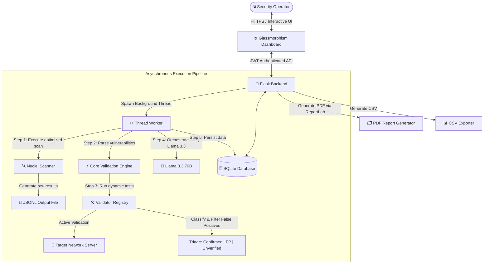

# 🦉 OwelSec AI — Vulnerability Scan Orchestration & AI Remediation Platform

<div align="center">

[](https://www.python.org/)
[](https://flask.palletsprojects.com/)
[](https://sqlite.org/)
[](https://github.com/projectdiscovery/nuclei)
[](https://groq.com/)
[](LICENSE)

**OwelSec AI** is a hyper-automated dashboard for vulnerability scan orchestration, active validation, and AI-driven remediation planning. By combining the velocity of the **Nuclei** DAST scanner with a custom **Active Validation** engine and the power of LLMs, OwelSec AI fully automates cyber triage, eliminates false positives, and generates high-fidelity reports as well as hardening playbooks for modern SOC (Security Operations Center) teams.

---

[Features](#-key-features) • [System Architecture](#-system-architecture) • [Project Structure](#-project-structure) • [Installation & Setup](#%EF%B8%8F-installation-and-setup) • [Security & Guardrails](#-security--enterprise-guardrails) • [Reports](#-reporting-engine)

</div>

---

## 🚀 Key Features

* **⚡ High-Performance DAST Scans**: Optimized Python wrapper around ProjectDiscovery's **Nuclei** engine. Integrates advanced rate-limiting management, strict request timeout control, and custom template concurrency (default 50) allowing deep scans to run in under 3 minutes (60% reduction in standard execution time).
* **🛡️ Active Validation Registry (Anti-False Positives)**: Secondary pipeline that dynamically queries targets after passive detection. It deploys targeted HTTP verification routines (CSS injection verification, TLS handshake suite analyzers, granular parsing of HTTP security headers) to strictly classify each flaw into three states: **Confirmed**, **False Positive**, or **Unverified**.
* **🤖 Generative Remediation Planner (AI)**: Integration of the **Groq** API via the cutting-edge `llama-3.3-70b-versatile` model. The AI acts as a Senior SOC Analyst: it translates complex payloads, evaluates the real risk level (Low, Medium, High, Critical) and drafts detailed threat analyses accompanied by directly actionable CLI hardening commands (system, code, config).
* **📊 Premium Glassmorphism Interface**: Modern dashboard designed following a unified dark-mode design system. Uses CSS variables for surface blur effects, fluid micro-animations on hover, interactive widgets, and severity counters updated in real-time.
* **📄 Multi-Format Reporting Engine**: One-click generation of comprehensive cyber audit reports. Standardized **CSV** export for SIEM integration and highly structured **PDF reports via ReportLab**, including threat level distribution charts and dedicated analysis sections for security experts.

---

## 📐 System Architecture

OwelSec AI relies on a decoupled and asynchronous architecture, protecting the user experience from heavy network scanning processing:




---

## 📂 Project Structure

```text
OwelSec_AI/
├── backend/brain/           # Core API & Scanner Logic
│   ├── api/                 # Flask routes, authentication, reports
│   ├── core/                # Engine orchestration, validator dispatch
│   ├── scanner/             # Nuclei wrapper & parallel execution
│   ├── validator/           # Active validation scripts (XSS, TLS, Headers)
│   ├── analyzer/            # Parsing logic for JSONL outputs
│   ├── data/                # Local SQLite DB & raw scan outputs
│   └── .env                 # Secrets & environment configurations
└── frontend/                # Interactive UI
    ├── index.html           # Main Dashboard
    ├── style.css            # Dark mode Glassmorphism styles
    ├── app.js               # API integration & state management
    └── logo/                # Brand assets

```

---

## ⚙️ Installation and Setup

### Prerequisites
- Python 3.10+
- [Nuclei](https://github.com/projectdiscovery/nuclei) (ProjectDiscovery) installed and accessible in your system `PATH`.

### 1. Clone & Environment
```bash
git clone https://github.com/redaxhacker/OwelSec-AI.git
cd OwelSec-AI/backend/brain

python -m venv .venv
source .venv/bin/activate  # On Windows use: .venv\Scripts\activate
pip install -r requirements.txt
```

### 2. Configuration
Copy the provided `.env.example` file to create your own `.env` configuration file:
```bash
cp .env.example .env
```
Ensure you add your `GROQ_API_KEY`, an `ADMIN_PASSWORD`, and a custom `JWT_SECRET`.

### 3. Run the Backend
```bash
python api/app.py
```
*The API will start on `http://0.0.0.0:5000`.*

### 4. Run the Frontend
In a separate terminal, serve the frontend directory:
```bash
cd OwelSec-AI/frontend
python -m http.server 8080
```
*Access the dashboard via your browser at `http://localhost:8080`.*

---

## 🔒 Security & Enterprise Guardrails

OwelSec AI implements robust protections to secure both its own environment and the scanning process:

- **Rate Limiting**: Protects backend endpoints to prevent resource exhaustion and abuse.
- **JWT Authentication**: Ensures only authorized administrators can launch scans or access sensitive data.
- **Controlled Scans**: Deep integration with Nuclei parameters guarantees minimal impact on target networks, executing non-destructive reconnaissance and controlled payloads.

---

## 📄 Reporting Engine

The platform offers a fully automated, one-click export system for your security audits:

- **PDF Export**: Generates professional, executive-ready PDF documents using ReportLab. Includes summary metrics, visual risk distribution charts, and granular technical findings.
- **CSV Export**: Provides raw, tabular data tailored for seamless integration into enterprise SIEM (Security Information and Event Management) platforms.

